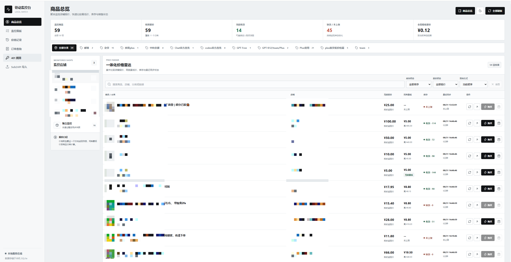
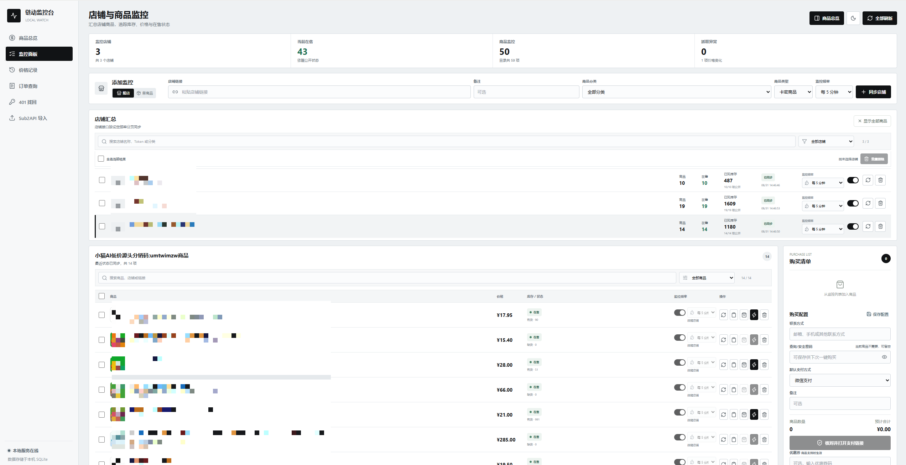
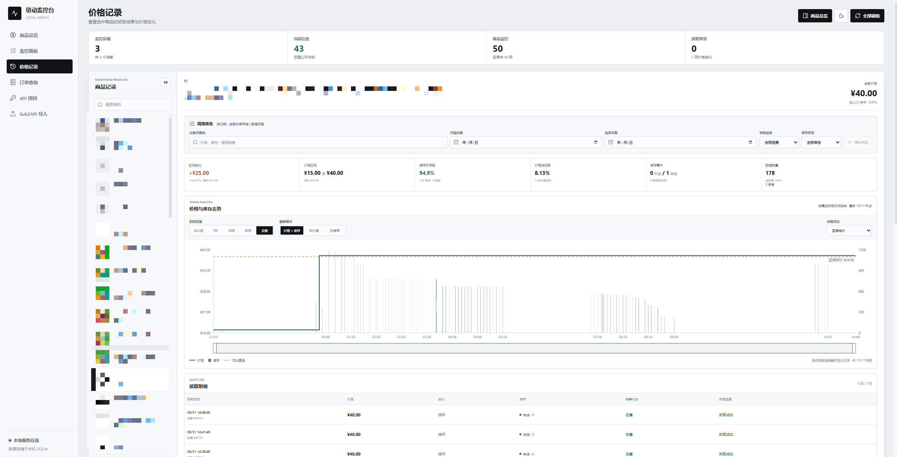
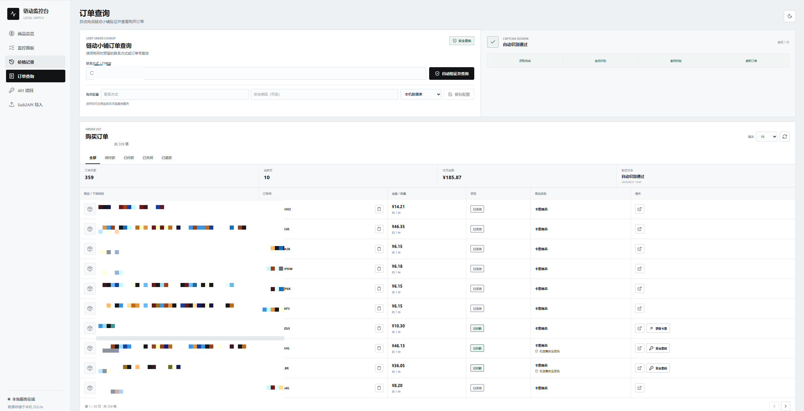
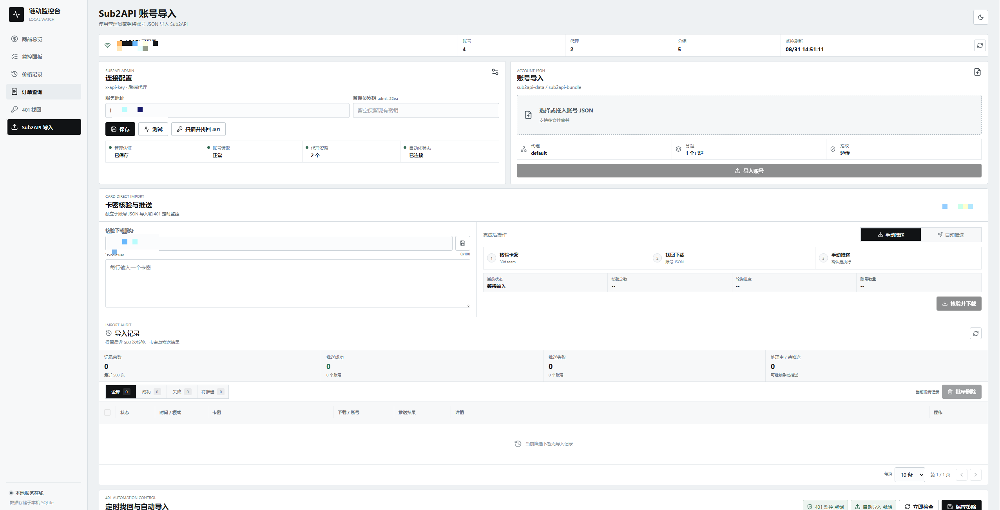

# 链动小铺本地监控台

本项目是一个本地运行的链动小铺监控工具，提供店铺/商品库存监控、价格记录、预购提醒、官方支付链接创建、401 卡密找回和 Sub2API 账号导入。

## 项目预览

首页总览：



功能界面：

库存监控：



价格记录：



订单查询：



Sub2API 导入：



## 项目交流群

欢迎加入QQ交流群：**964974938**

## 运行要求

- Windows PowerShell；
- 可联网安装依赖；脚本会**自动检查并引导安装 Python、Node.js/npm；**

## 快速启动

### 一键启动命令（推荐）

为避免下载的 `start.ps1` 被 PowerShell 阻止，可以直接双击项目根目录中的 `start.cmd`，或在 PowerShell 中运行：

```powershell
.\start.cmd
```

该启动器仅对当前进程临时绕过执行策略，并设置 `LDXP_AUTO_INSTALL=1`。如果可用，缺少的 Python、Node.js、npm 和项目依赖会通过 `winget` 自动安装。也可以传入以下参数：

```powershell
.\start.cmd -BootstrapOnly
.\start.cmd -SkipInstall
```

脚本会自动：

- 安装缺失的前端依赖；
- 检查并安装 Selenium；
- 清理本项目遗留的开发进程；
- 为后端和前端选择可用端口；
- 启动两个服务并打印访问地址。

启动后终端会显示类似以下内容，使用其中的 Frontend 地址打开浏览器：

```text
LDXP services started
Frontend:      http://127.0.0.1:<frontend-port>
Backend API:   http://127.0.0.1:<backend-port>
Health check:  http://127.0.0.1:<backend-port>/api/health
Ports:         frontend=<frontend-port>  backend=<backend-port>
```

按 `Ctrl+C` 停止前端，脚本会同时停止由它启动的后端。

### 分开启动

适合需要分别查看前后端日志的场景。打开两个 PowerShell 窗口，并都定位到项目根目录。

后端：

```powershell
python .\backend\main.py
```

前端：

```powershell
npm --prefix .\frontend install
npm --prefix .\frontend run dev -- --host 127.0.0.1 --port 5173
```

默认地址为：

- 前端：`http://127.0.0.1:5173/`
- 后端健康检查：`http://127.0.0.1:8000/api/health`

Vite 会把 `/api` 请求代理到 `127.0.0.1:8000`。后端端口变更时，启动前端前设置：

```powershell
$env:LDXP_API_TARGET = 'http://127.0.0.1:<backend-port>'
```

## 版本更新

管理员可在“系统设置 -> 版本与更新”查看当前版本、Git 提交、运行分支和工作树状态，并从 GitHub 检查或安装更新。自动更新只会在以下条件同时满足时执行：

- 当前分支与目标分支一致；
- 工作树没有未提交或未跟踪文件；
- `origin` 与配置的 GitHub 仓库一致；
- 远端提交可通过 fast-forward 合并。

更新成功后需重启后端与前端服务。默认更新源为 `https://github.com/qion888/ldsub2api.git` 的 `main` 分支，可通过环境变量配置：

| 环境变量                     | 默认值                                        | 用途                           |
| ------------------------ | ------------------------------------------ | ---------------------------- |
| `LDXP_UPDATE_REPOSITORY` | `https://github.com/qion888/ldsub2api.git` | GitHub 更新仓库                  |
| `LDXP_UPDATE_BRANCH`     | `main`                                     | 允许自动更新的目标分支                  |
| `LDXP_UPDATE_REMOTE`     | `origin`                                   | Git 远端名称                     |
| `LDXP_GITHUB_TOKEN`      | 空                                          | GitHub API 令牌，可提高访问限额或读取私有仓库 |

## 主要功能

### 店铺和商品监控

- 支持 `https://pay.ldxp.cn/shop/<SHOP_TOKEN>` 整店同步，以及 `https://pay.ldxp.cn/item/<ITEM_KEY>` 单商品监控。
- 粘贴链接后会自动识别类型；整店同步支持商品类型和可选分类 ID。
- 整店接口分页获取商品名称、价格、市场价、图片、销售状态和公开库存。
- 店铺和商品可单独暂停、刷新、删除；商品也可以批量移出本地目录。
- 子商品刷新会同步所属店铺，避免子商品接口没有公开库存时显示旧数据。同一轮监控中，同店商品只请求一次店铺库存。
- 价格记录页保留最近抓取结果，可查看价格变化、在售状态和失败原因。

### 库存刷新和自动预购

- 顶部“全部刷新”同时刷新启用的店铺和商品。
- 选中商品设置预购前会先通过所属店铺同步库存。
- 只有明确缺货（库存为 `0`）的商品才会进入预购；库存未知或已有库存的商品不会创建预购任务。
- 可设置每个商品的预购数量和库存检查间隔，间隔范围为 `1` 至 `86400` 秒。
- 库存达到目标后只创建一次官方订单并保存支付链接；订单创建成功或失败后任务停止。

### 官方支付链接

1. 将在售商品加入购买清单。
2. 在右侧购买配置中填写联系方式，按需填写查询/安全密码，选择支付宝或微信支付。
3. 点击“保存配置”保存下次使用的配置，再点击核对并打开支付链接。
4. 工具会重新校验商品状态、价格、起购数量和店铺信息，然后创建官方订单并打开返回的支付页。

说明：

- 官方订单接口一次只支持一个商品；多商品清单需要分别创建订单。
- `limit_count` 表示最低起购数量，不代表限购上限；单项数量范围为 `1` 至 `99`。
- 本工具只创建订单和打开支付页，不代替用户在支付宝或微信页面完成付款。
- 联系方式和查询密码保存在本机 SQLite 中；不需要查询密码的商品不会向上游提交密码。

### 401 找回

“401 找回”页面支持配置找回服务地址，并对卡密执行：

- 健康检查：区分正常、明确 401、不可找回和未知状态；
- 只找回 401：只提交明确的授权失败，不处理其他错误；
- 刷新进度：查询已提交任务；
- 下载 JSON：将已完成的找回结果下载并放入 Sub2API 导入区。

一次最多提交 `100` 个卡密，支持空格、逗号或换行分隔。卡密只应填写在本地界面或已配置的服务中。

### Sub2API 导入和自动化

- 在“Sub2API 导入”页面配置服务地址和管理员 API Key。
- 管理员 API Key 通过 `x-api-key` 请求头发送，不是 `Authorization: Bearer` JWT。
- 保存配置后可以加载 Sub2API 现有代理和分组，并为本次导入选择代理、分组。
- 支持选择或拖拽多个 JSON；单文件最大 `8 MB`，一次最多 `50` 个文件，总大小不超过 `24 MB`，合并后账号和代理各不超过 `5000` 条。
- 支持保留 JSON 自带代理、不绑定代理或绑定 Sub2API 现有代理。
- Codex 指纹收敛支持 `off`、`device`、`session`、`full` 四种模式。导入后会核对实际写入值，必要时补写并显示核对结果。
- “一键找回 401”会扫描 Sub2API 账号，只处理明确的 HTTP/OAuth 401，读取账号名称末尾的卡密，提交找回并轮询结果。
- 找回完成后会自动下载、合并 JSON；开启自动导入后，使用已保存的代理、分组和指纹设置导入 Sub2API。
- 自动化需要管理员 Key、一个现有代理、至少一个分组、非 `off` 指纹模式，并勾选“找回后自动导入”。监控间隔范围为 `10` 至 `86400` 秒，也可手动立即检查。

## 常用操作流程

### 添加整店

1. 选择“整店”。
2. 粘贴店铺链接，按需填写商品类型、分类和关键词。
3. 设置同步间隔并点击“同步店铺”。
4. 在店铺汇总或商品目录中查看库存和状态。

### 添加单商品

1. 选择“单商品”。
2. 粘贴商品链接并设置监控间隔。
3. 点击“开始监控”。
4. 在商品行点击刷新，或使用“全部刷新”。

### 设置预购

1. 勾选库存为 `0` 的商品。
2. 点击“设置预购”，确认每个商品的数量。
3. 勾选“启用自动预购”，设置检查间隔。
4. 确认购买配置已保存后启用任务。
5. 库存满足数量后，在预购任务中打开支付链接。

## 本地配置和数据

运行时数据库为 `backend/monitor.db`，首次启动会自动创建。它保存店铺、商品、快照、预购任务和本地配置；账号 JSON 只在导入请求期间处理，不写入该数据库。

主要环境变量：

| 变量                  | 默认值                      | 用途           |
| ------------------- | ------------------------ | ------------ |
| `LDXP_HOST`         | `127.0.0.1`              | 后端监听地址       |
| `LDXP_PORT`         | `8000`                   | 后端监听端口       |
| `LDXP_FRONTEND_URL` | `http://127.0.0.1:5173/` | 后端根路径跳转地址    |
| `LDXP_DB_PATH`      | `backend/monitor.db`     | SQLite 数据库路径 |
| `LDXP_API_TARGET`   | `http://127.0.0.1:8000`  | Vite 开发代理目标  |

## 开发验证

在项目根目录执行：

```powershell
python -m unittest discover -s .\backend -p "test_*.py"
npm --prefix .\frontend install
npm --prefix .\frontend run build
```

后端依赖见 `backend/requirements.txt`，前端依赖及脚本见 `frontend/package.json`。

## 项目结构

```text
backend/
  main.py             后端 API、抓取 worker 和自动化 worker
  monitor.db          运行时 SQLite 数据库（自动生成）
  requirements.txt    Python 依赖
  test_main.py        后端测试
frontend/
  src/main.jsx        React 页面和交互逻辑
  src/style.css       页面样式
  package.json        前端脚本和依赖
start.ps1             一键启动脚本
PAYMENT.md            官方支付链路补充说明
redeem_api_sdk.py     401 找回服务 SDK
```

